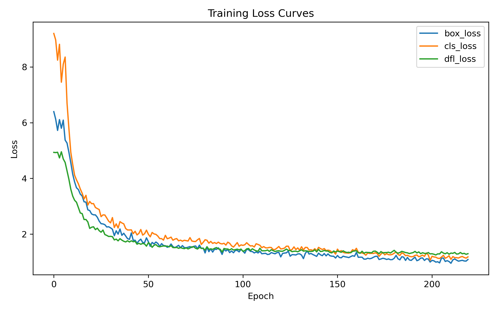
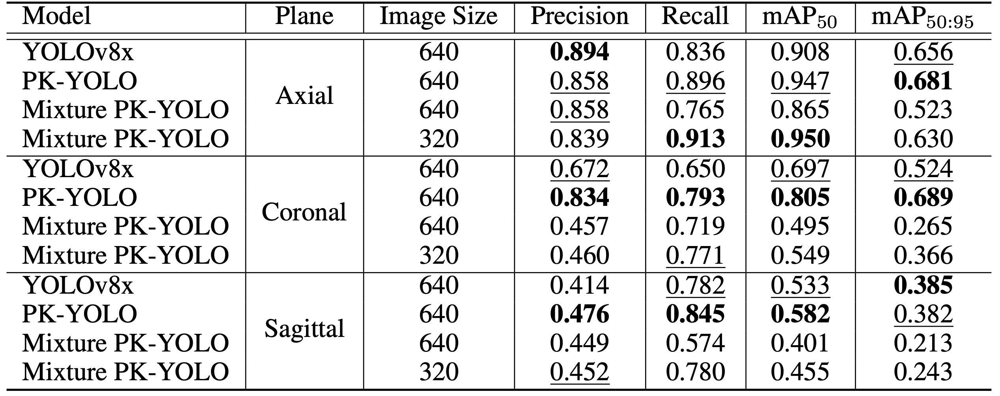
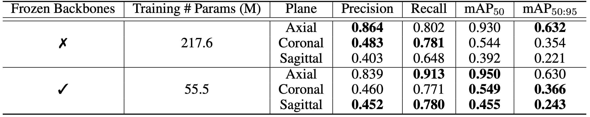

# PK-YOLO

> [!NOTE]
> This repository is a **fork** of [PK-YOLO](https://github.com/mkang315/PK-YOLO) [[1]](#1) with some modifications.
> Original credits and license are preserved. We are not affiliated with the authors.
> We appreciate the original authors' work.

## Installation

```bash
conda create -n <env-name> python==3.12.4
conda activate <env-name>
pip-compile --output-file=requirements.txt requirements.in
pip install -r requirements.txt
```

## Preparation

#### Dataset Preparation

> [!IMPORTANT]
> Before running a program, please go [here](https://github.com/3seoksw/Brain-Tumor-PK-YOLO/tree/main/data/) for preparing the dataset required for the training.

#### Pretraining

Pretraining code can be found [here](https://github.com/3seoksw/Brain-Tumor-PK-YOLO/tree/main/spark/pretrain).

## Training

```bash
python train_dual.py
```

## Result

### Training Result



Three losses are measured; `box_loss` representing bounding box loss, `cls_loss` representing classification loss, and `dlf_loss` representing objectness loss.

### Experimental Result

#### Performance Comparison



Comparison of model performance across planes.
Bold numbers shows the best performance, and underline shows the second-best performance.
PK-YOLO remains to achieve state-of-the-art performance, and proposed Mixture PK-YOLO achieves reasonable performance, while showing higher Recall and mAP$_{50}$ metrics on axial plane.

#### Ablation Study


Ablation study on freezing backbones.
Bold numbers show higher performance.
Not only does freezing the backbones reduce the amount of training parameters, but also increases the overall model performance.

## Reference

<a id="1" href="">[1]</a>
M. Kang, F. F. Ting, R. C.-W. Phan, and C.-M. Ting, "Pk-yolo: Pretrained knowledge guided yolo for brain tumor detection in multiplane mri slices," in
<i>Proc. Winter Conf. Appl. Comput. Vis. (WACV)</i>, Tucson, AZ, USA, Feb. 28–Mar. 4, 2025, pp. 3732–3741.
